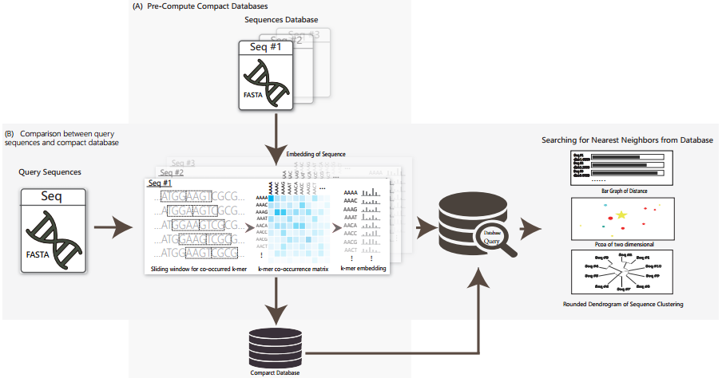

# **CRAFT**
**Compact genome Representation towards large-scale**

**Alignment-Free daTabase**

Thank you for downloading CRAFT, a tool for Compact Representations of large-scale Alignment-Free genomic/metagenomic sequences daTabase and fast sequence comparisons between sequencing data/long genomic sequences and the compact database.

## **Description of the framework of CRAFT:**

  

CRAFT is composed of two modules:

(A)	Precompute the compact representations of genomic/metagenomic databases. The compact databases were precomputed to embedding vectors and stored in CRAFT with the following steps: count the co-occurred k-mers of the query sequences with sliding window; based on the co-occurrence of context k-mers, each k-mer is tranformed to a vector (embedding). Current CRAFT stored Refseq representative/complete genome and HMP1-II metagenome databases.

(B)	Fast query for N-nearest neighbors in databases for the input DNA data. When a user input a nucleotide sequencing data or a long DNA sequence, the query sequence(s) will be transformed to embedding vector and calculate the distance with the reference database, and output the top N-nearest neighbors in the database. When a user input the query of an unknown sequencing data or a long genomic sequence, CRAFT fast returns the top 10 nearest neighbors from the precomputed compact database which has smallest dissimilarity with the query data.

CRAFT compacts representation of reference sequences with GloVe[1], an unsupervised learning algorithm for obtaining vector representations for words. CRAFT works with sequence data, both long genomic sequences and shotgun sequence reads from NGS technologies, embeds sequences into vector representation for easy storage and comparison.

CRAFT provides three types of visualized downstream analysis, including the distance bar graphe, two-dimension projection using principal coordinate analysis (PCoA) and sequence clustering into a rounded dendrogram by using the neighbour-joining algorithm.

All the analysis can be performed by simply clicking through well-designed graphical user interface (GUI) on two common operating systems (Linux and Windows) .

**[1] Pennington, J., R. Socher, and C. Manning. Glove: Global vectors for word representation. in Proceedings of the 2014 conference on empirical methods in natural language processing (EMNLP). 2014.**

Three pre-computed compact databases
============

Currently, we pre-compacted the three databases

(1) All the 139,576 Refseq assembly nucleotide genomes, updated by June, 2018. The size of the database is compacted from 829.60GB(.fa) to 3GB.--*(Since this database requires 3GB of space, it is not included in the zip file. During the running of CRAFT, if the user selected the button of "Refseq complete genome", the download webpage will be automatic linked or [**here**](https://github.com/jiaxingbai/CRAFT/blob/master/download-refseq.md)  to download and save in ./CRAFT-linux-x64/Refseq folder or ./CRAFT_wins_1.0/Refseq. )*

(2)The 7,106 Refseq representative nucleotide genomes, updated by June, 2018. The size of the database is compacted from 376.38GB(.fa) to 148M.--*(This database is included in the zip file.)*

(3)The 2,355HMP1-II metagenomic samples, which includes **309 skin samples, 234 Vaginal samples, 1,259 Oral samples and 553 Gutsamples,** from 7.13TB (.sra) to 50.4 MB. The sample information is [**here**](https://github.com/jiaxingbai/CRAFT/blob/master/HMP1-II-info.txt).--*(This database is included in the zip file.)*

Direct Running
============

CRAFT can be run directly after decompressing the .zip archive on Windows and Linux operating systems without any installation, extra enviromental settings or configurations.

Direct Running on Windows
------------------------
CRAFT has been tested on Windows (Win7,Win8 and Win10)
> 1. Download the Windows Version of CRAFT  from  [**here**](https://github.com/jiaxingbai/CRAFT/blob/master/downloadui.md).
> 2. Unzip it.
> 3. Within the folder, double-click **CRAFT.exe**.

Direct Running  on Linux
------------------------
CRAFT has been tested on Linux (Ubuntu14/16/18, Debian 9, CentOS 7, Fedora 29 and Oracle Server 7.6). Because of system difference of Linux, some dll files might not be included. We have included the missing dll files during our testing. If other dll files are require, they can be downloaded [**here**](https://github.com/jiaxingbai/CRAFT/blob/master/linux-so). And copy the missing dll to CRAFT_linux folder.
> 1. Download the Linux Version of CRAFT  from [**here**](https://github.com/jiaxingbai/CRAFT/blob/master/downloadui.md ).
> 2. Unzip it.
> 3. Use commandline : "cd CRAFT-linux-x64" and "./CRAFT" to start running CRAFT.( **Please run CRAFT with command line instead of double clicks on Linux.** )

Usage
=====

Guidance on Graphical User Interface
------------------------

  

The graphical user interface has the layout shown in the above figure, containing five parts in terms of functionality:

1、	Red area: Start new session, input query file and run the comparison:

  :  Select a new database for query.

  :  Select the query file. The sequence data can be either long genomic sequences or shotgun sequence reads from NGS technologies, with the file extension 'fasta','fasta.gz','fasta.bz2','fa','fa.gz','fa.bz2','fna','fna.gz','fna.bz2','fastq','fastq.gz','fastq.bz2','fq','fq.gz','fq.bz2'

   :  Run CRAFT to compare the query file with the selected database.

2、Green area : Select the database to compare or build your database to compare.

3、Yellow area : Select the subgroup for comparison in the database. The refseq database includes: Archaea, Bacteria, Fungi, Invertebrate, Plant, Vertebrate, Mammalian, Vertebrate other and Viral. The HMP1-II database includes: skin, oral, vaginal and gut.

4、Purple area : Three visualizations of the comparing result : including the distance bar graphe, two dimensional projection using principal coordinate analysis (PCoA) and sequence clustering into a rounded dendrogram by using the neighbor-joining algorithm. Each analysis is shown in the respective tabbed window. The figure can be saved locally by clicking the button or right-clicking the mouse.

 : Save the current figure.

  

5、	Blue area in following figure：The blue area gives the tracking of running steps of distance measures.

  

6、  The text files of the produced kmer embedding vector and the distance matrix are saved in folder resources/app/output for user's further analysis.

An  Example of Graphical User Interface
------------------------

Here we go through a toy example step-by-step.  You can find a folder named "data" in the unzipped folder.

1、Click  to start a new session.

2、Select Refseq representative/complete database or the HMP1-II dataset.

3、Click the button  and select the testing data under "data" folder. And click the button . The results in text format will be saved in folder with the naming of resources/app/output/. When same query file is input again, CRAFT will reload the resulting file and directly offer the visualization figures.

4、The result is available in visualized plots and would be saved with right clicking of mouse or clicking the button  on left bottom. Also, we can track the progress through the console in the bottom panel.The text files of the produced kmer embedding vector and the distance matrix are saved in folder resources/app/output for user's further analysis.

<Notice: The query filename can't include space character.>
------------------------

  

Once the visualized results have been plotted, the figure can be saved locally by clicking the  button or through the popup menu by right-clicking the mouse.

  

Distance bar graphe between the query sequence and the top-10 nearest neighbors in the database.

  

Two dimensional projection using principal coordinate analysis (PCoA).

  

Rounded dendrogram using the neighbour-joining algorithm.

  

Usage of  command line running
------------------------

> Command:   ./CRAFT.sh  -i (input file) -o (output dir) -d (database) -s (kingdom|option)

> - Main arguments:

	-i   <input file> :  Input your query sequence fasta file.

	-o   <output dir> : The folder for Ooutput results to file at <output dir>.

	-d   <database>   :  The compact database for comparison with the query sequences.You can use different database in Refseq floder. E.g :
                         Refseq/Refseq
                         Refseq/Refseqrep
                         Refseq/HMP

    -c  <compact fasta file> : Input your fasta file to build your own compact database.

	-r  <database output dir> :  Output your own compact database to file at <database output dir>.

	-s   <kingdom|option> :  This argument is optional. It limits the is a optionthe subgroups for comparison. You can choose the kingdom to reduce the computing time. But it is ddifferent in different database.

		Refseq :
		    1. all 2. archaea 3. bacteria 4. fungi 5. invertebrate 6. plant 7. protozoa 8.vertebrate_mammalian 9 vertebrate_other 10. viral

		Refseq_rep :
		    1. all

            HMP :
                1. all 2. Skin 3. Oral 4. Gut

> - Examples:

    Load Refseqrep database to compare the input fasta file:
        ./CRAFT.sh -i testdata/Testing_Refseq_representativegenome_TriboliumcastaneumstrainGeorgiaGA2.fna.gz -o resources/app/output/ -d Refseq/Refseqrep -s all

    Load HMP database to compare the input fasta file:
        ./CRAFT.sh -i testdata/Testing-Metagenome-HumanGut-ERR011201.fna.gz -o resources/app/output/ -d Refseq/HMP -s all

    Build your own compact database:
        ./CRAFT.sh -c testdata/build/GCF_000006665.1_ASM666v1_genomic.fna.gz,testdata/build/GCF_000006925.2_ASM692v2_genomic.fna.gz,testdata/build/GCF_000007445.1_ASM744v1_genomic.fna.gz,testdata/build/GCF_000008865.2_ASM886v2_genomic.fna.gz,testdata/build/GCF_000012005.1_ASM1200v1_genomic.fna.gz -r ./my_database -o resources/app/

    Load your prebuilt database to compare the input fasta file:
        ./CRAFT.sh -i testdata/Testing-Metagenome-HumanGut-ERR011201.fna.gz -o resources/app/output/ -d my_database

Contacts and bug reports
========================

Please send bug reports, comments, or questions to

Prof. Ying Wang: [wangying@xmu.edu.cn](mailto:wangying@xmu.edu.cn)

Yang Lu: [ylu465@usc.edu](mailto:ylu465@usc.edu)

Jiaxing Bai: [23220181152322@stu.xmu.edu.cn](mailto:23220181152322@stu.xmu.edu.cn)

----------

Last update: 31-Dec-2018

