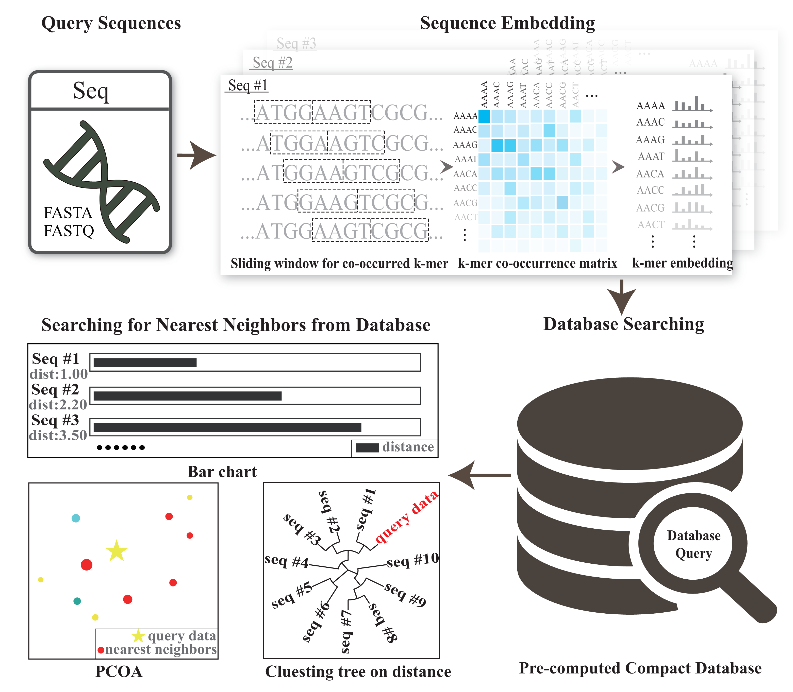

# CRAFT
## Compact genome Representation towards large-scale Alignment-Free daTabase

Thank you for downloading CRAFT, a tool for Compact Representations of large-scale Alignment-Free genomic/metagenomic sequences daTabase and fast sequence comparisons between sequencing data/long genomic sequences and the compact database.CRAFT parses the input genomic/metagenomic sequences, counts the co-occurrences of adjacent k-mer pairs, learns the embeddings, searches against archived repositories by the dissimilarity between the input and the archived sequences in the embedding space, and finally reports the best matches in various ways.

## Download

Linux:

[**Baidu Cloud:**](https://pan.baidu.com/share/init?surl=Lj2RsfzyE6jHuPnhLt1wLQ)Fetch Code:8hv0

[**Google Drive:**](https://drive.google.com/file/d/1limEbG53vvUOqVBTvqIhaxQcUbpDXVK3/view?usp=sharing)

wins:

[**Baidu Cloud:**](https://pan.baidu.com/share/init?surl=m4-nTtExTHszDkOBOSl8Tw)Fetch Code:8uz1

[**Google Drive:**](https://drive.google.com/file/d/13kBxpnwv_OtwzGP72QY8GJ4R1NFEvjno/view?usp=sharing)

## Framework of CRAFT

<p align="center">
  
</p>

 **CRAFT includes two key processing steps: *embedding* and *dissimilarity*.**

  Given a genomic/metagenomic sequence as input, *embedding* learns its compact representation by mapping nucleotide sequences into low-dimensional space. In brief, CRAFT counts the co-occurred *k*-mers of the query sequence with *1*-bp step-size sliding windows. Based upon the co-occurrence of adjacent *k*-mers, each *k*-mer is transformed to a vector using the GloVe algorithm[1]. After that, *dissimilarity* calculates the dissimilarities between the query sequence and the sequences in the archived repositories, in terms of their learned compact representations.

CRAFT compacts representation of reference sequences with GloVe[1], an unsupervised learning algorithm for obtaining vector representations for words. CRAFT works with sequence data, both long genomic sequences and shotgun sequence reads from NGS technologies, embeds sequences into vector representation for easy storage and comparison.

CRAFT provides three types of visualized downstream analysis, including the distance bar graphe, two-dimension projection using principal coordinate analysis (PCoA) and sequence clustering into a rounded dendrogram by using the neighbour-joining algorithm.

All the analysis can be performed by simply clicking through well-designed graphical user interface (GUI) on two common operating systems (Linux and Windows) .

**<font size="1" face="黑体">[1] Pennington, J., R. Socher, and C. Manning. Glove: Global vectors for word representation. in Proceedings of the 2014 conference on empirical methods in natural language processing (EMNLP). 2014.</font>**


## Three pre-computed compact databases


Currently, we pre-compacted three databases for the fast query of nearest neighbors for the input sequences

(1) All the 139,576 NCBI assembly nucleotide genomes, updated by June, 2018. The size of the database is compacted from 829.60GB(.fa) to 2.93GB.--*(Since this database requires 2.93GB of space, it is not included in the zip file. During the running of CRAFT, if the user selected the button of "NCBI assembly", the download webpage will be automatic linked or [**here**](https://github.com/jiaxingbai/CRAFT/blob/master/download-refseq.md)  to download and save in ./CRAFT-linux-x64/Refseq folder or ./CRAFT_wins_1.0/Refseq. )*

(2)The 7,106 Refseq representative nucleotide genomes, updated by June, 2018. The size of the database is compacted from 376.38GB(.fa) to 152.67M.--*(This database is included in the zip file.)*

(3)The 2,355 HMP 1-II metagenomic samples, which includes **309 skin samples, 234 Vaginal samples, 1,259 Oral samples and 553 Gutsamples,** from 7.13TB (.sra) to 50.40 MB. The sample information is [**here**](https://github.com/jiaxingbai/CRAFT/blob/master/HMP1-II-info.txt).--*(This database is included in the zip file.)*


## Running on two operation systems

CRAFT can be run directly after decompressing the .zip archive on Windows and Linux operating systems without any installation, extra enviromental settings or configurations.

### Running on Windows
CRAFT has been tested on Windows (Win7,Win8 and Win10)
> 1. Download the Windows Version of CRAFT from [**here**](https://github.com/jiaxingbai/CRAFT/blob/master/download_GUI.md).
> 2. Unzip it.
> 3. Within the folder, double-click **CRAFT.exe**.
<p align="center">

</p>

### Running  on Linux
CRAFT has been tested on Linux (Ubuntu14/16/18, Debian 9, CentOS 7, Fedora 29 and Oracle Server 7.6). Because of system difference of Linux, some dll files might not be included. We have included the missing dll files during our testing. If other dll files are require, they can be downloaded [**here**](https://github.com/jiaxingbai/CRAFT/blob/master/linux-so). And copy the missing dll to CRAFT_linux folder.
> 1. Download the Linux Version of CRAFT  from [**here**](https://github.com/jiaxingbai/CRAFT/blob/master/download_GUI.md ).
> 2. Unzip it.
> 3. Use commandline : "cd CRAFT-linux-x64" and "./CRAFT" to start running CRAFT.( **Please run CRAFT with command line instead of double clicks on Linux.** )
<p align="center">

</p>

## Usage


### Guidance on Graphical User Interface

<p align="center">
  
</p>
**The graphical user interface has the layout shown in the above figure, containing five parts in terms of functionality**:
.
**1、	Red area: Start new session, input query file and run the comparison**:

  :  Select a new database for query for the nearest neighbors of the input sequence.

  :  Select the input file. The sequence data can be either long genomic sequences or shotgun sequence reads from NGS technologies, with the file extension 'fasta','fasta.gz','fasta.bz2','fa','fa.gz','fa.bz2','fna','fna.gz','fna.bz2','fastq','fastq.gz','fastq.bz2','fq','fq.gz','fq.bz2'

   :  Run CRAFT to compare the query file with the selected database.

**2、Green area : Select the pre-compact database or build the compact representation your own database to search for the best matches (nearest neighbors) of the query sequences**.

**3、Yellow area : Select the major taxonomical subgroup in the database for comparison**.

Refseq representative database and  NCBI assembly database includes: Archaea, Bacteria, Fungi, Invertebrate, Plant, Vertebrate, Mammalian, Vertebrate other and Viral. The HMP1-II dataset includes: skin, oral, vaginal and gut.

**4、Black area : Select whether to use the branch and bound algorithm to speed up the searching with the price of accuracy, which is optional for in  NCBI assembly database. ( The default is selected.)**

**5、Purple area : Three visualizations of the comparing result**

Including the distance bar graphe, two dimensional projection using principal coordinate analysis (PCoA) and sequence clustering into a rounded dendrogram by using the neighbor-joining algorithm. Each analysis is shown in the respective tabbed window. The figure can be saved to local disk by clicking the button or right-clicking the mouse.

 : Save the current figure.

<p align="center">
  
</p>

**6、	Blue area in the followed figure：The blue area gives the progress of running steps**.

<p align="center">
  
</p>

**7、 Build you own compact database**

CRAFT offers the interface to build the compact dataset for your own data. If select "build your compact database" in green area, you can load your own data and build the compact database. Then CRAFT can query for the nearest neighbors in your own database with "input query file" or calculate the dissimilarity matrix for samples(genomes) in your own dataset. The built database is stored as My_Database/ My_Database by default.

<p align="center">
  
</p>

**8、 If one dataset has been compressed by CRAFT, then it can be reloaded to CRAFT with "import your prebuilt compact database"**.

<p align="center">
  
</p>

**9、  The compact representation the produced kmer embedding vector and the distance matrix are saved as text format in folder resources/app/output for user's further analysis**.

### An  Example of Graphical User Interface


**Here we go through two toy examples step-by-step.  You can find a folder named "testdata" in the unzipped folder**.

**Query HTS genomic data in the three compressed genomic sequence databases**.

1、Click  to start a new session.

2、Select Refseq representative, NCBI assembly or the HMP1-II.

3、Click  and select the testing data under "testdata" folder. And click . The results in text format will be saved in folder with the naming of resources/app/output/. When same query file is input again, CRAFT will reload the resulting file and directly offer the visualization figures.

4、The result is available in visualized plots and would be saved with right clicking of mouse or clicking the button  on left bottom. Also, we can track the progress through the console in the bottom panel.The text files of the produced kmer embedding vector and the distance matrix are saved in folder resources/app/output for user's further analysis.

<br>

**Build your compact database.**

1、Click  to start a new session.

2、Select "build your compact database".

3、Click  to choose your genomes data, with the file extension 'fasta','fasta.gz','fasta.bz2','fa','fa.gz','fa.bz2','fna','fna.gz','fna.bz2','fastq','fastq.gz','fastq.bz2','fq','fq.gz','fq.bz2'.

4、Enter the output name where your database will be saved and click  to build the database.

5、After building the database, you can click  to calculate the distance between two genes in the database and  for query HTS genomic data in this database.

**Import your compact database.**

1、Click  to start a new session.

2、Select "build your compact database".

3、Click "Import Your Prebuilt Compact database" to conversion interface.

4、Click  to load your Prebuilt database.

5、Click  for query HTS genomic data in this database.

```diff
- <Notice: The query filename can't include space character.>
```

Once the visualized results have been plotted, the figure can be saved locally by clicking the  button or through the popup menu by right-clicking the mouse.

<p align="center">
  
</p>

<p align="center">
<font size="1">Distance bar graphe between the query sequence and the top-10 nearest neighbors in the database.</font>
</p>
<p align="center">
  
</p>

<p align="center">
<font size="1">Two dimensional projection using principal coordinate analysis (PCoA).</font>
</p>
<p align="center">
  
</p>

<p align="center">
<font size="1">Rounded dendrogram using the neighbour-joining algorithm.</font>
</p>
<p align="center">
  
</p>


### Usage of  command line running

> Command:   Query data: ./CRAFT.sh  -i < input file > -o < output dir > -d < database > -s < kingdom|option >
             Compact database: ./CRAFT.sh  -c < path file > -r < database output name >  -o < output dir >

> - Main arguments:

	-i   <input file> :  Input your query sequence fasta file.

	-o   <output dir> : The folder for kmc, embedding adn query results to file at <output dir>.

	-d   <database>   :  The compact database for comparison with the query sequences.You can use different database in Refseq floder or your prebulit database. E.g :
                         Refseq/Refseq ( NCBI assembly database )
                         Refseq/Refseqrep ( Refseq representative database )
                         Refseq/HMP ( Human Microbiome Project )


    -c  <path file> : A file that lists the paths of the fna file.

	-r  <database output name> :  Output your own compact database to file at <database output namee>.

	-s   <kingdom|option> :  This argument is optional.
	                         It limits the is a option the subgroups for comparison. You can choose the kingdom to reduce the computing time. But it is different in different database.

		Refseq :
		    1. all 2. archaea 3. bacteria 4. fungi 5. invertebrate 6. plant
		    7. protozoa 8.vertebrate_mammalian 9 vertebrate_other 10. viral

		Refseq_rep :
		    1. all

            HMP :
                1. all 2. Skin 3. Oral 4. Gut

> - Examples:


    Load Refseqrep database to compare the input fasta file:
        ./CRAFT.sh -i testdata/Testing_Refseq_representativegenome_TriboliumcastaneumstrainGeorgiaGA2.fna.gz -o resources/app/output/ -d Refseq/Refseqrep -s all

    Load HMP database to compare the input fasta file:
        ./CRAFT.sh -i testdata/Testing-Metagenome-HumanGut-ERR011201.fna.gz -o resources/app/output/ -d Refseq/HMP -s all

    Build your own compact database:
        ./CRAFT.sh -c test.txt -r ./my_database -o resources/app/

    Load your prebuilt database to compare the input fasta file:
        ./CRAFT.sh -i testdata/Testing-Metagenome-HumanGut-ERR011201.fna.gz -o resources/app/output/ -d my_database

## Contacts and bug reports


Please send bug reports, comments, or questions to

Prof. Ying Wang: [wangying@xmu.edu.cn](mailto:wangying@xmu.edu.cn)

Yang Lu: [ylu465@usc.edu](mailto:ylu465@usc.edu)

Jiaxing Bai: [23220181152322@stu.xmu.edu.cn](mailto:23220181152322@stu.xmu.edu.cn)

----------


Last update: 27-Nov-2019


